# 🛡️ Amal Cyber Lab — Cybersecurity Cheat Sheets

### Volume 1 | Microsoft Azure & Cybersecurity

A practical collection of **12 visual cybersecurity cheat sheets** covering Microsoft Azure Security, Microsoft Security, SIEM/SOC operations, KQL, Zero Trust, MITRE ATT&CK®, and security best practices.

> **Learn → Build → Secure → Improve**

---

## 🚀 About This Series

I created this series as part of my continuous learning journey in **Cybersecurity, Microsoft Azure Security, Cloud Security, SOC Operations, and Threat Detection**.

The goal was to transform important security concepts into **quick, visual, and practical reference guides** that can be useful for:

* 🎓 Cybersecurity students
* ☁️ Cloud Security learners
* 🛡️ Security Engineers
* 🚨 SOC Analysts
* 🔎 Threat Hunters
* 💻 IT Professionals
* 📚 Microsoft Security certification candidates

The series focuses on understanding security concepts rather than simply memorizing terminology.

---

# 📚 Volume 1 — 12 Cheat Sheets

## 01. 🔐 Azure Security Services

Core Azure security services and their primary security use cases.

**Topics include:**

* Microsoft Defender for Cloud
* Azure Firewall
* WAF
* DDoS Protection
* Key Vault
* Microsoft Entra ID
* Sentinel
* Azure networking security
* Identity and access controls

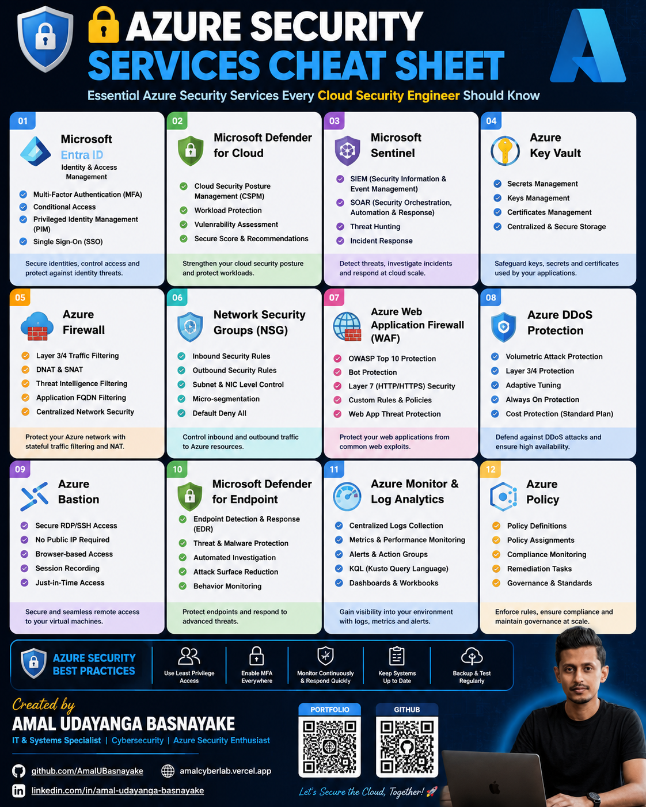

---

## 02. 🛡️ Microsoft Defender XDR

A visual reference covering Microsoft's extended detection and response ecosystem.

**Topics include:**

* Defender for Endpoint
* Defender for Office 365
* Defender for Identity
* Defender for Cloud Apps
* Microsoft Defender XDR
* Advanced Hunting
* Incident investigation
* Automated response

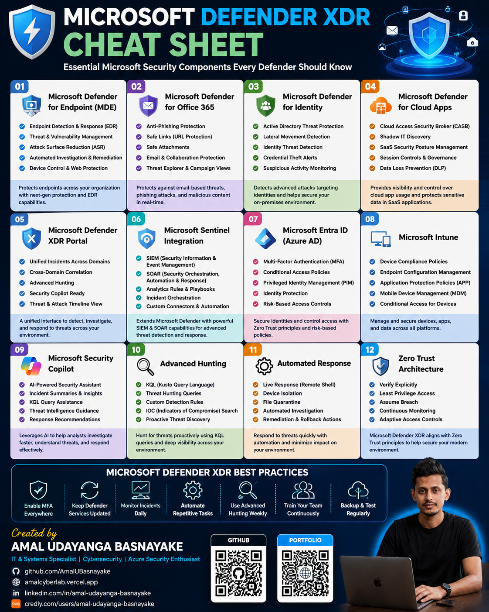

---

## 03. 🌐 Azure Networking Security

Essential Azure networking security services and concepts.

**Topics include:**

* Network Security Groups
* Azure Firewall
* WAF
* DDoS Protection
* Azure Bastion
* VPN Gateway
* ExpressRoute
* Private Endpoint
* Service Endpoint
* Application Gateway
* UDR
* Azure DNS Private Resolver

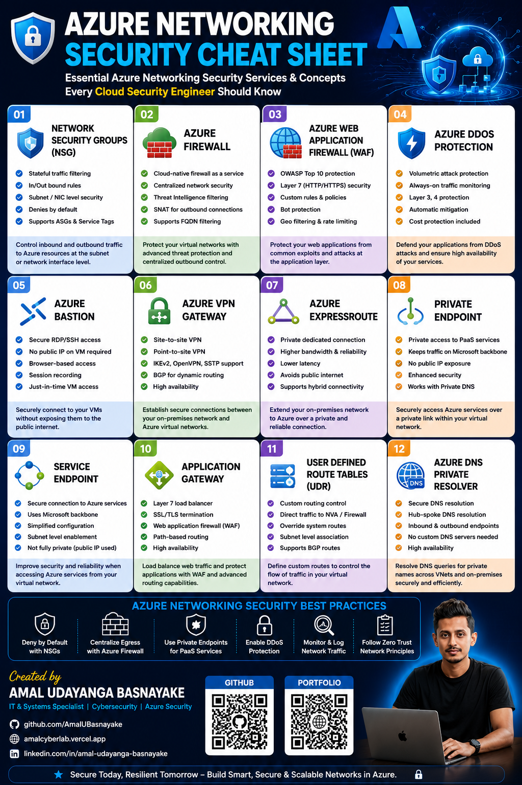

---

## 04. 🔑 Microsoft Entra ID

Identity and access management fundamentals for Microsoft cloud environments.

**Topics include:**

* Users & Groups
* Authentication
* Conditional Access
* MFA
* PIM
* Administrative Roles
* Application Registrations
* Enterprise Applications
* Identity Protection
* Access Reviews
* Audit & Sign-in Logs
* Zero Trust

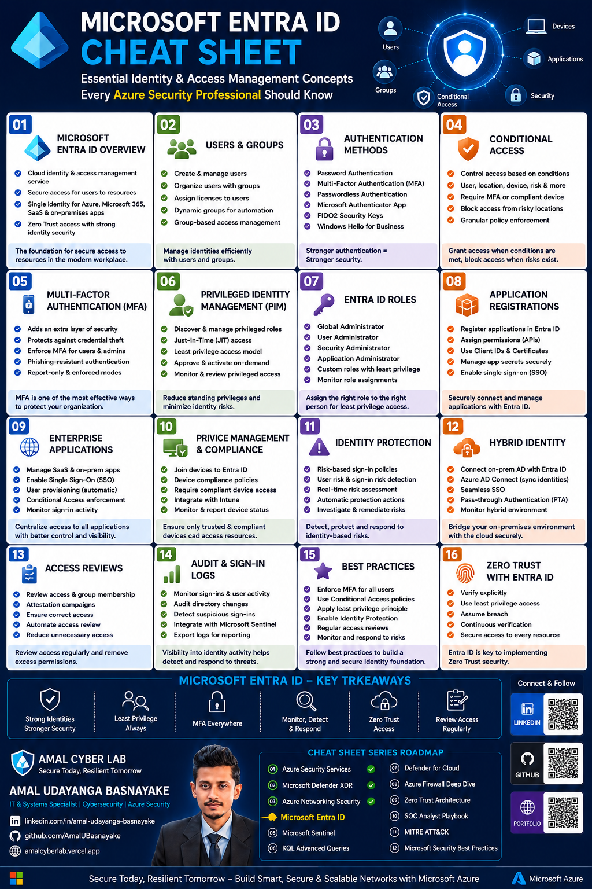

---

## 05. 🚨 Microsoft Sentinel

A practical reference for Microsoft's cloud-native SIEM and SOAR platform.

**Topics include:**

* Log Analytics Workspace
* Data Connectors
* KQL
* Analytics Rules
* Incidents
* Workbooks
* Playbooks
* Threat Hunting
* UEBA
* Threat Intelligence
* Automation
* RBAC

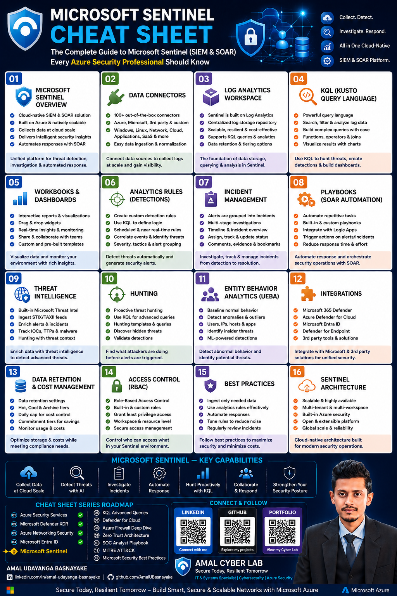

---

## 06. 📊 KQL Advanced Queries

A quick reference for advanced Kusto Query Language techniques used in security analytics and threat hunting.

**Topics include:**

* `where`
* `summarize`
* `project`
* `extend`
* `join`
* `union`
* `distinct`
* `parse`
* `let`
* Time-based analysis
* Aggregation
* Regex
* Threat hunting techniques

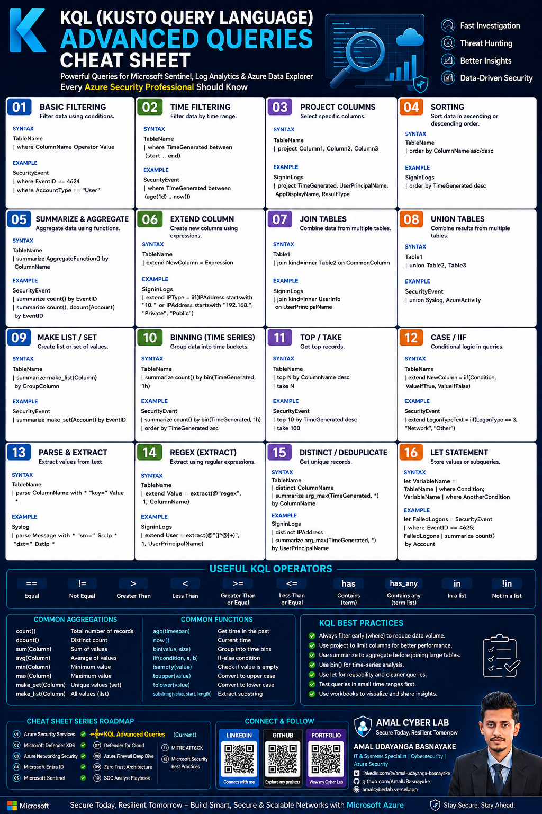

---

## 07. ☁️ Microsoft Defender for Cloud

Cloud security posture management and workload protection concepts.

**Topics include:**

* CSPM
* CWPP
* Security Recommendations
* Vulnerability Management
* Compliance
* Threat Detection
* Multi-cloud Security
* JIT VM Access
* Security Posture
* Defender Plans

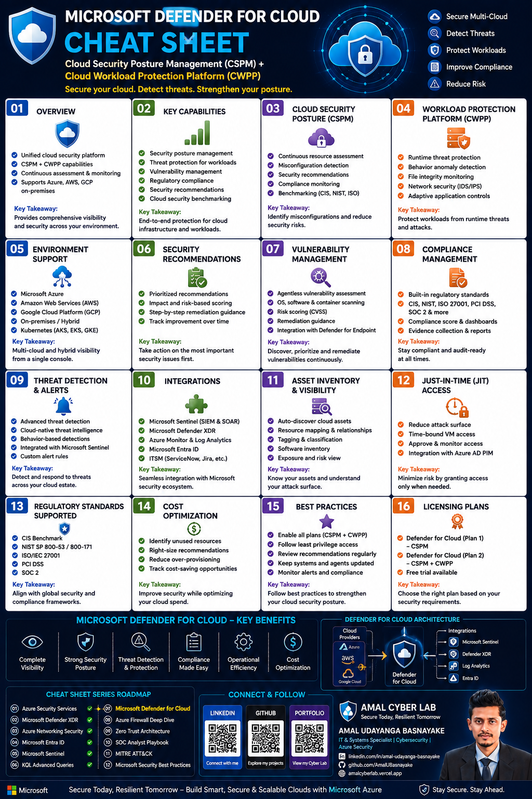

---

## 08. 🔥 Azure Firewall Deep Dive

A deeper reference for Azure Firewall architecture, traffic inspection, and centralized network security.

**Topics include:**

* Azure Firewall Architecture
* Hub-and-Spoke
* Firewall Policy
* Network Rules
* Application Rules
* Threat Intelligence
* DNAT / SNAT
* Routing
* Availability Zones
* Monitoring & Logging
* Hybrid Connectivity
* Best Practices

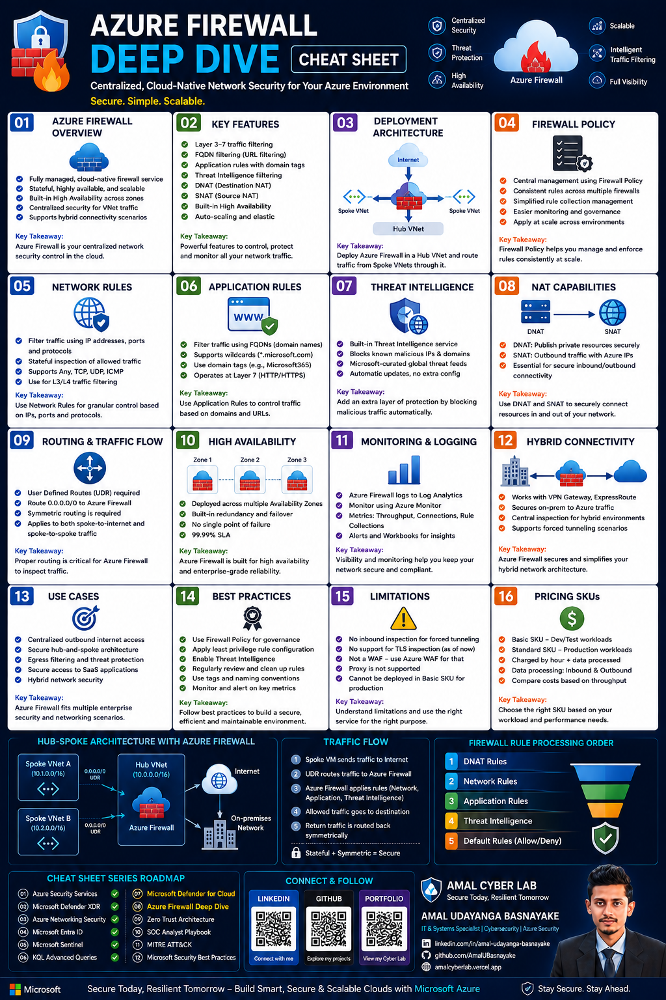

---

## 09. 🌐 Zero Trust Architecture

A practical visual reference for implementing the Zero Trust security model.

### Core principles

> **Verify Explicitly → Use Least Privilege → Assume Breach**

**Topics include:**

* Identity
* Devices
* Applications
* Data
* Network
* Visibility
* Policy Enforcement
* Threat Protection
* RBAC / PIM
* Conditional Access
* Zero Trust Maturity

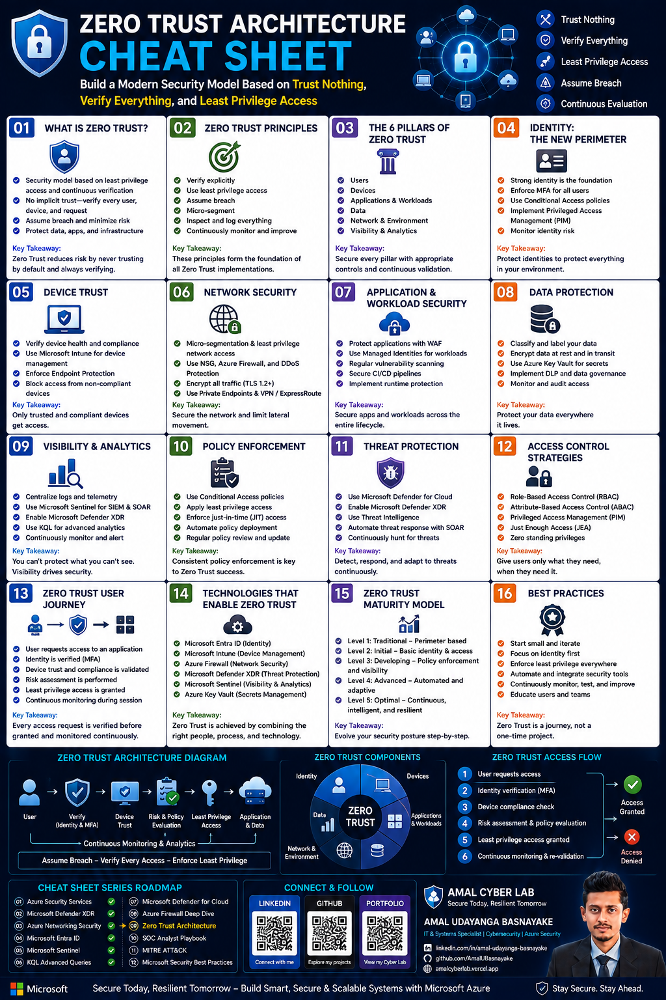

---

## 10. ⚡ SOC Analyst Playbook

A practical reference for Security Operations Center workflows.

### Incident Response Lifecycle

**Detect → Triage → Investigate → Contain → Eradicate → Recover → Document → Communicate**

**Topics include:**

* Alert Triage
* Incident Investigation
* Threat Hunting
* Incident Prioritization
* Escalation
* KQL
* Common Alert Sources
* Analyst Best Practices
* SOC KPIs

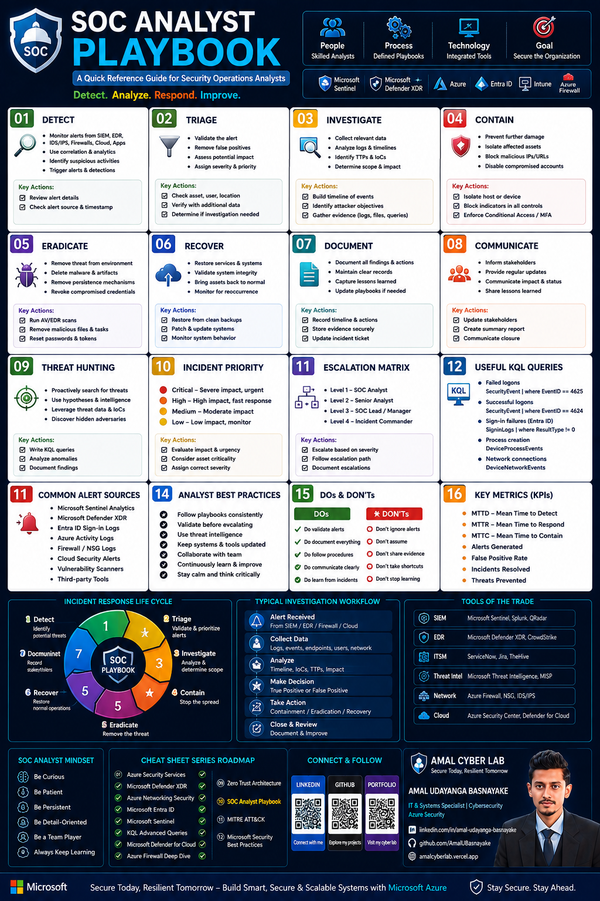

---

## 11. 🛡️ MITRE ATT&CK®

A visual reference for understanding real-world adversary behavior.

**Topics include:**

* Tactics
* Techniques
* Sub-techniques
* Procedures
* Data Sources
* Mitigations
* ATT&CK Matrix
* Detection Engineering
* Threat Hunting
* Incident Response
* Security Coverage

MITRE ATT&CK® helps security teams understand **why and how adversaries operate** and provides a common language for mapping defensive capabilities.

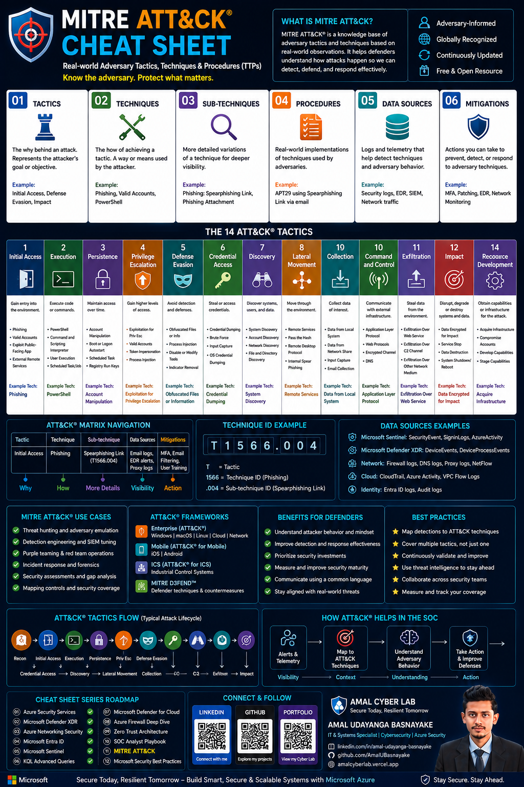

---

## 12. 📈 Microsoft Security Best Practices

The final cheat sheet of Volume 1 brings together practical security principles across the Microsoft security ecosystem.

**Topics include:**

* Identity Security
* Device Security
* Application Security
* Data Security
* Infrastructure Security
* Threat Protection
* Security Operations
* Governance & Compliance
* Business Continuity
* Security Culture
* Zero Trust
* Security KPIs
* Risk Mitigation

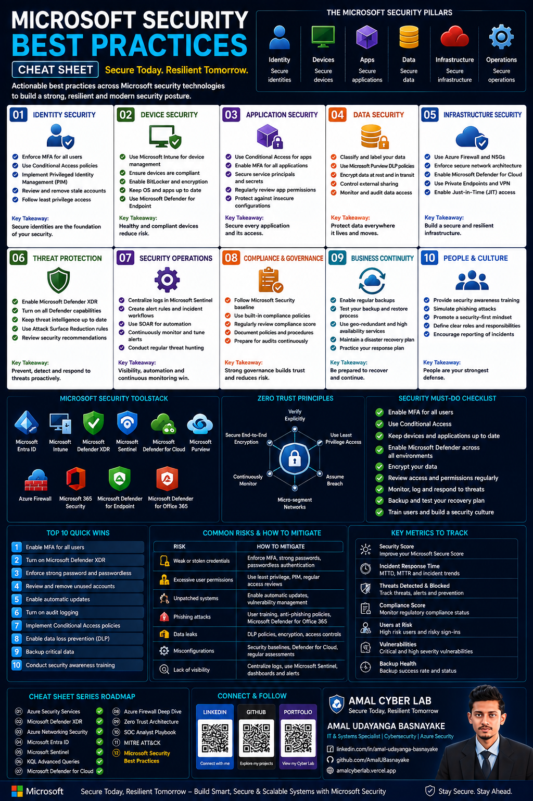

---

# 🧭 Series Roadmap

| #  | Topic                             | Status |
| -- | --------------------------------- | ------ |
| 01 | Azure Security Services           | ✅      |
| 02 | Microsoft Defender XDR            | ✅      |
| 03 | Azure Networking Security         | ✅      |
| 04 | Microsoft Entra ID                | ✅      |
| 05 | Microsoft Sentinel                | ✅      |
| 06 | KQL Advanced Queries              | ✅      |
| 07 | Microsoft Defender for Cloud      | ✅      |
| 08 | Azure Firewall Deep Dive          | ✅      |
| 09 | Zero Trust Architecture           | ✅      |
| 10 | SOC Analyst Playbook              | ✅      |
| 11 | MITRE ATT&CK®                     | ✅      |
| 12 | Microsoft Security Best Practices | ✅      |

---

# 🎯 What I Learned

Building these resources helped me strengthen my understanding of:

* 🔐 Identity & Access Management
* ☁️ Azure Cloud Security
* 🌐 Network Security
* 🚨 SIEM & SOAR
* 📊 KQL & Threat Hunting
* 🛡️ XDR & Threat Detection
* 🎯 MITRE ATT&CK®
* 🌐 Zero Trust
* ⚡ SOC Operations
* 📈 Security Governance & Best Practices

More importantly, this series reinforced the idea that **security services should not be learned in isolation**.

Identity, networking, detection, monitoring, governance, and response all work together to build a resilient security architecture.

---

# 🧪 Learning Approach

This repository is part of my **hands-on cybersecurity learning journey**.

I combine:

**Concepts → Labs → Architecture → Detection → Investigation → Evidence → Documentation**

The cheat sheets are designed as quick references, while the practical implementation is explored through hands-on cybersecurity labs and projects.

---

# 👨‍💻 About the Author

### Amal Udayanga Basnayake

**IT & Systems Specialist | Cybersecurity | Azure Security**

Focused on:

* Microsoft Azure Security
* Microsoft 365 Security
* Microsoft Sentinel
* SIEM & SOAR
* Threat Detection
* Cloud Security
* Identity & Access Management
* Zero Trust
* Security Operations

---

## 🌐 Connect With Me

🔗 **LinkedIn**
linkedin.com/in/amal-udayanga-basnayake

💻 **GitHub**
github.com/AmalUBasnayake

🌐 **Portfolio**
amalcyberlab.vercel.app

---

# ⭐ Support the Project

If you find these cheat sheets useful:

⭐ Star this repository

🔄 Share it with other cybersecurity learners

💬 Open an issue with suggestions

📚 Use the resources for your learning journey

---

## ⚠️ Disclaimer

These cheat sheets are created for **educational and reference purposes**.

They are intended to support learning and should not replace official Microsoft documentation, security policies, organizational standards, or professional security guidance.

For production environments, always validate configurations against current vendor documentation and your organization's security requirements.

---

# 🚀 What's Next?

**Volume 1 is complete.**

The next stage will move beyond fundamentals into more advanced areas of:

☁️ Azure Security Engineering

🔐 Identity Architecture

🚨 Detection Engineering

📊 Advanced Threat Hunting

🌐 Cloud Security Architecture

🛡️ Incident Response

⚙️ Security Automation

📈 Governance & Risk

> **Secure Today. Resilient Tomorrow.**
>
> — Amal Cyber Lab 🛡️
