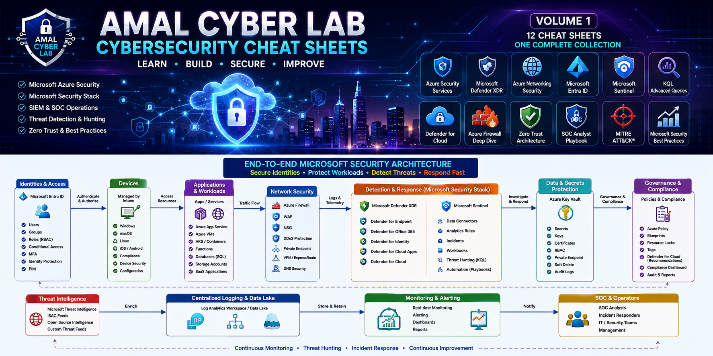
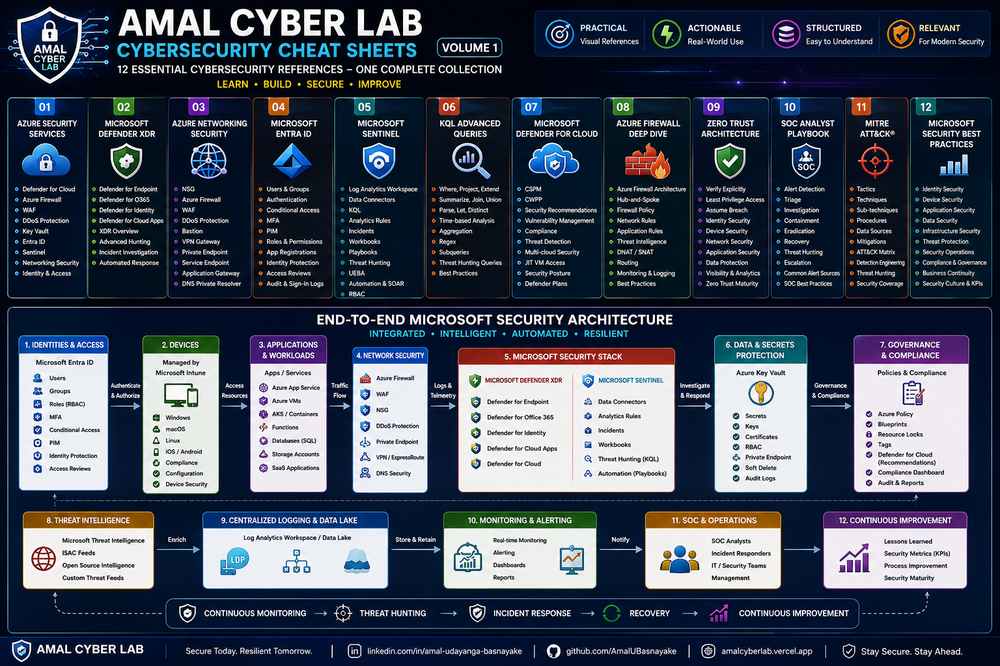

# 🛡️ Amal Cyber Lab - Cybersecurity Cheat Sheets

<p align="center">
  
</p>

<h2 align="center">Volume 1 | 12 Essential Cybersecurity References</h2>

<p align="center">
  <strong>Learn • Build • Secure • Improve</strong>
</p>

<p align="center">
  Microsoft Azure Security • Microsoft Security • SIEM • SOC • KQL • Zero Trust • Threat Detection
</p>

---

## 📑 Table of Contents

- [About This Repository](#-about-this-repository)
- [End-to-End Microsoft Security Architecture](#-end-to-end-microsoft-security-architecture)
- [Volume 1 - 12 Cheat Sheets](#-volume-1---12-cheat-sheets)
- [Series Roadmap](#-series-roadmap)
- [What This Series Reinforced](#-what-this-series-reinforced)
- [Learning Methodology](#-learning-methodology)
- [Technologies Covered](#️-technologies-covered)
- [About the Author](#-about-the-author)
- [Connect With Me](#-connect-with-me)
- [Support This Project](#-support-this-project)
- [Disclaimer](#️-disclaimer)
- [What's Next](#-whats-next)

---

## 🚀 About This Repository

Welcome to **Amal Cyber Lab - Cybersecurity Cheat Sheets**.

This repository contains a collection of **12 visual cybersecurity cheat sheets** created as part of my continuous learning journey in:

- ☁️ Microsoft Azure Security
- 🛡️ Microsoft Security
- 🔐 Identity & Access Management
- 🚨 SIEM & SOC Operations
- 📊 KQL & Threat Hunting
- 🌐 Zero Trust Architecture
- 🎯 MITRE ATT&CK®
- ⚡ Incident Response
- 📈 Security Best Practices

The goal is to transform complex security concepts into **clear, practical, and easy-to-reference visual resources**.

> **Security knowledge becomes more valuable when you can connect the concepts, architecture, controls, detection, investigation, and response together.**

---

# 🏗️ End-to-End Microsoft Security Architecture

The following architecture connects the major security capabilities covered throughout this collection.

<p align="center">
  
</p>

### 🔐 Architecture Flow

```text
Identity & Access
       ↓
Users & Devices
       ↓
Applications & Workloads
       ↓
Network Security
       ↓
Defender XDR + Microsoft Sentinel
       ↓
Centralized Logging + KQL + Threat Intelligence
       ↓
SOC Operations
       ↓
Detection → Triage → Investigation → Response
       ↓
Threat Hunting
       ↓
Continuous Monitoring
       ↓
Continuous Improvement
```

### 🧩 Security Layers

| Layer | Key Capabilities |
|---|---|
| 🔐 Identity | Entra ID, MFA, Conditional Access, PIM, RBAC |
| 💻 Devices | Intune, device security, compliance |
| 🧱 Workloads | Azure VMs, App Services, AKS, databases, storage |
| 🌐 Network | NSG, Azure Firewall, WAF, DDoS, Private Endpoint |
| 🛡️ Detection | Defender XDR, Defender for Cloud, Sentinel |
| 📊 Analytics | Log Analytics, KQL, Threat Intelligence |
| ⚡ Response | Incidents, Playbooks, Containment, Recovery |
| 📈 Governance | Azure Policy, Compliance, Audit, Security Metrics |

---

# 📚 Volume 1 - 12 Cheat Sheets

## 01. 🔐 Azure Security Services

A quick visual reference covering the essential security services available across Microsoft Azure.

### Key Topics

- Microsoft Defender for Cloud
- Azure Firewall
- Web Application Firewall
- DDoS Protection
- Azure Key Vault
- Microsoft Entra ID
- Microsoft Sentinel
- Azure Networking Security
- Identity & Access Controls
- Cloud Security Architecture

<p align="center">
  
</p>

---

## 02. 🛡️ Microsoft Defender XDR

A visual reference to Microsoft's extended detection and response ecosystem.

### Key Topics

- Defender for Endpoint
- Defender for Office 365
- Defender for Identity
- Defender for Cloud Apps
- Microsoft Defender XDR
- Advanced Hunting
- Incident Investigation
- Threat Detection
- Automated Response

<p align="center">
  
</p>

---

## 03. 🌐 Azure Networking Security

Essential Azure networking security services and concepts.

### Key Topics

- Network Security Groups
- Azure Firewall
- Azure WAF
- DDoS Protection
- Azure Bastion
- VPN Gateway
- ExpressRoute
- Private Endpoint
- Service Endpoint
- Application Gateway
- User Defined Routes
- Azure DNS Private Resolver

<p align="center">
  
</p>

---

## 04. 🔑 Microsoft Entra ID

A practical identity and access management reference for Microsoft cloud environments.

### Key Topics

- Users & Groups
- Authentication Methods
- Conditional Access
- MFA
- Privileged Identity Management
- Administrative Roles
- Application Registrations
- Enterprise Applications
- Identity Protection
- Hybrid Identity
- Access Reviews
- Audit & Sign-in Logs
- Zero Trust

<p align="center">
  
</p>

---

## 05. 🚨 Microsoft Sentinel

A practical reference for Microsoft's cloud-native SIEM and SOAR platform.

### Key Topics

- Log Analytics Workspace
- Data Connectors
- KQL
- Analytics Rules
- Incidents
- Workbooks
- Playbooks
- Threat Hunting
- UEBA
- Threat Intelligence
- Automation
- RBAC

<p align="center">
  
</p>

---

## 06. 📊 KQL Advanced Queries

A quick reference for Kusto Query Language techniques used for security analytics and threat hunting.

### Key Topics

- `where`
- `project`
- `summarize`
- `extend`
- `join`
- `union`
- `distinct`
- `parse`
- `let`
- Time-based analysis
- Aggregation
- Regex
- Threat Hunting

<p align="center">
  
</p>

---

## 07. ☁️ Microsoft Defender for Cloud

A visual reference covering cloud security posture management and workload protection.

### Key Topics

- CSPM
- CWPP
- Security Recommendations
- Vulnerability Management
- Compliance Management
- Threat Detection
- Multi-Cloud Security
- JIT VM Access
- Security Posture
- Defender Plans

<p align="center">
  
</p>

---

## 08. 🔥 Azure Firewall Deep Dive

A deeper reference covering Azure Firewall architecture and centralized network security.

### Key Topics

- Azure Firewall Architecture
- Hub-and-Spoke
- Firewall Policy
- Network Rules
- Application Rules
- Threat Intelligence
- DNAT & SNAT
- Routing & Traffic Flow
- Availability Zones
- Monitoring & Logging
- Hybrid Connectivity
- Security Best Practices

<p align="center">
  
</p>

---

## 09. 🌐 Zero Trust Architecture

A practical visual guide to modern Zero Trust security architecture.

### Core Principles

> **Verify Explicitly • Use Least Privilege • Assume Breach**

### Key Topics

- Identity Security
- Device Trust
- Network Security
- Application Security
- Data Protection
- Visibility & Analytics
- Policy Enforcement
- Threat Protection
- RBAC
- PIM
- Conditional Access
- Zero Trust Maturity

<p align="center">
  
</p>

---

## 10. ⚡ SOC Analyst Playbook

A practical reference for Security Operations Center workflows and incident response.

### Incident Response Lifecycle

```text
Detect
  ↓
Triage
  ↓
Investigate
  ↓
Contain
  ↓
Eradicate
  ↓
Recover
  ↓
Document
  ↓
Communicate
  ↓
Improve
```

### Key Topics

- Alert Detection
- Alert Triage
- Incident Investigation
- Evidence Collection
- Threat Hunting
- Incident Prioritization
- Escalation
- KQL
- Common Alert Sources
- SOC Best Practices
- SOC KPIs

<p align="center">
  
</p>

---

## 11. 🛡️ MITRE ATT&CK®

A practical visual reference for understanding real-world adversary behavior.

### Key Topics

- Tactics
- Techniques
- Sub-techniques
- Procedures
- Data Sources
- Mitigations
- ATT&CK Matrix
- Detection Engineering
- Threat Hunting
- Incident Response
- Security Coverage
- Adversary Behavior

### ATT&CK Perspective

```text
Why?
  ↓
Tactic
  ↓
How?
  ↓
Technique
  ↓
More Detail
  ↓
Sub-Technique
  ↓
Real-World Example
  ↓
Procedure
```

<p align="center">
  
</p>

---

## 12. 📈 Microsoft Security Best Practices

The final cheat sheet of Volume 1 brings together practical security principles across the Microsoft security ecosystem.

### Key Topics

- Identity Security
- Device Security
- Application Security
- Data Security
- Infrastructure Security
- Threat Protection
- Security Operations
- Compliance & Governance
- Business Continuity
- Security Culture
- Zero Trust
- Security KPIs
- Risk Mitigation

<p align="center">
  
</p>

---

# 🧭 Series Roadmap

| # | Cheat Sheet | Status |
|---|---|---|
| 01 | Azure Security Services | ✅ |
| 02 | Microsoft Defender XDR | ✅ |
| 03 | Azure Networking Security | ✅ |
| 04 | Microsoft Entra ID | ✅ |
| 05 | Microsoft Sentinel | ✅ |
| 06 | KQL Advanced Queries | ✅ |
| 07 | Microsoft Defender for Cloud | ✅ |
| 08 | Azure Firewall Deep Dive | ✅ |
| 09 | Zero Trust Architecture | ✅ |
| 10 | SOC Analyst Playbook | ✅ |
| 11 | MITRE ATT&CK® | ✅ |
| 12 | Microsoft Security Best Practices | ✅ |

### 🎉 Volume 1 — Complete

**12 Cheat Sheets • One Complete Collection**

---

# 🧠 What This Series Reinforced

Building this collection helped me connect multiple areas of cybersecurity instead of learning them as isolated technologies.

### 🔐 Identity

Microsoft Entra ID → MFA → Conditional Access → PIM → Zero Trust

### 🌐 Network

NSG → Azure Firewall → WAF → DDoS → Private Endpoint → Secure Architecture

### 🚨 Detection

Microsoft Defender → Sentinel → KQL → Threat Intelligence → Analytics Rules

### ⚡ Response

Detection → Triage → Investigation → Containment → Eradication → Recovery

### 🎯 Adversary Understanding

Threat Intelligence → MITRE ATT&CK® → Threat Hunting → Detection Engineering

### 📈 Governance

Security Controls → Compliance → Monitoring → Metrics → Continuous Improvement

---

# 🧪 Learning Methodology

These cheat sheets are part of a broader hands-on learning approach:

```text
CONCEPT
   ↓
ARCHITECTURE
   ↓
IMPLEMENTATION
   ↓
HANDS-ON LAB
   ↓
DETECTION
   ↓
INVESTIGATION
   ↓
EVIDENCE
   ↓
DOCUMENTATION
   ↓
IMPROVEMENT
```

The objective is not simply to memorize security services.

The objective is to understand:

> **Why the control exists → What risk it addresses → How it is implemented → What evidence it produces → How it is monitored → How it is improved.**

This approach connects the visual references in this repository with practical cybersecurity labs, architecture work, detection engineering, investigation, and documentation.

---

# 🛠️ Technologies Covered

### Microsoft Azure

- Azure Firewall
- Azure WAF
- Azure DDoS Protection
- Azure Bastion
- Azure VPN Gateway
- ExpressRoute
- Private Endpoint
- NSG
- Azure Key Vault
- Azure Monitor

### Microsoft Security

- Microsoft Entra ID
- Microsoft Defender XDR
- Defender for Endpoint
- Defender for Office 365
- Defender for Identity
- Defender for Cloud Apps
- Microsoft Defender for Cloud
- Microsoft Sentinel
- Microsoft Intune
- Microsoft Purview

### Security Operations

- SIEM
- SOAR
- KQL
- Threat Hunting
- Incident Response
- Detection Engineering
- MITRE ATT&CK®
- Threat Intelligence

---

# 🎯 Who Is This For?

This collection is designed as a practical reference for:

- 🎓 Cybersecurity students
- ☁️ Cloud Security learners
- 🛡️ Security Engineers
- 🚨 SOC Analysts
- 🔎 Threat Hunters
- 💻 IT Professionals
- 📚 Microsoft Security certification candidates

---

# 👨‍💻 About the Author

## Amal Udayanga Basnayake

**IT & Systems Specialist | Cybersecurity | Azure Security**

Focused on building practical expertise in:

- ☁️ Azure Security
- 🛡️ Microsoft Security
- 🚨 SIEM & SOC Operations
- 📊 KQL & Threat Detection
- 🔐 Identity & Access Management
- 🌐 Zero Trust
- ⚡ Security Automation
- 🏗️ Cloud Security Architecture

---

# 🌐 Connect With Me

<p align="center">

<a href="https://www.linkedin.com/in/amal-udayanga-basnayake">

</a>

<a href="https://github.com/AmalUBasnayake">

</a>

<a href="https://amalcyberlab.vercel.app">

</a>

</p>

---

# ⭐ Support This Project

If you find these resources useful:

⭐ **Star this repository**

🔄 **Share it with other cybersecurity learners**

💬 **Open an issue with suggestions**

📚 **Use the cheat sheets as learning references**

---

# ⚠️ Disclaimer

These cheat sheets are created for **educational and reference purposes**.

They are not intended to replace official Microsoft documentation, vendor guidance, organizational security policies, or professional security advice.

Cloud security services, features, pricing, licensing, and capabilities can change over time.

Always validate production implementations against the latest official documentation and your organization's security requirements.

---

# 🚀 What's Next?

## Volume 1 is complete.

The next stage of the **Amal Cyber Lab** journey will move deeper into:

☁️ Azure Security Engineering  
🔐 Identity Architecture  
🚨 Detection Engineering  
📊 Advanced Threat Hunting  
🏗️ Cloud Security Architecture  
⚡ Security Automation  
🛡️ Incident Response  
📈 Governance & Risk

> **Secure Today. Resilient Tomorrow.**
>
> **— Amal Cyber Lab**
